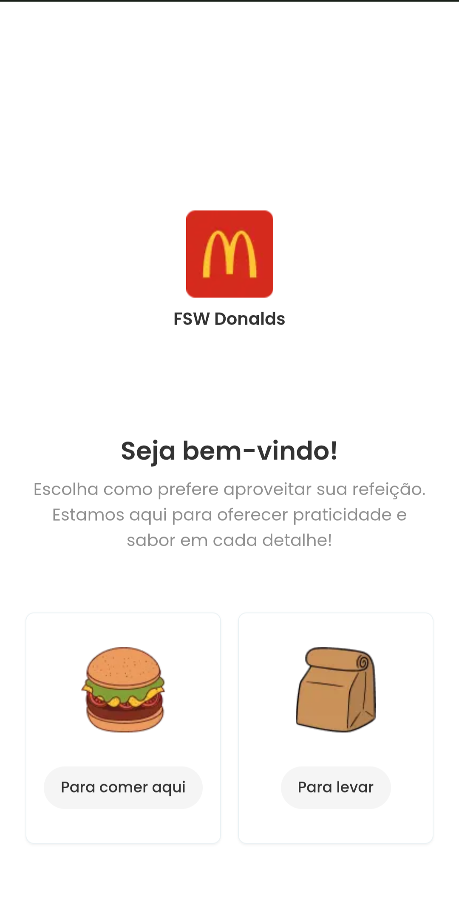
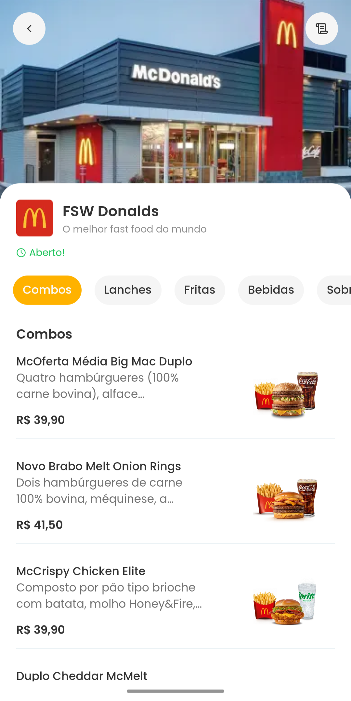
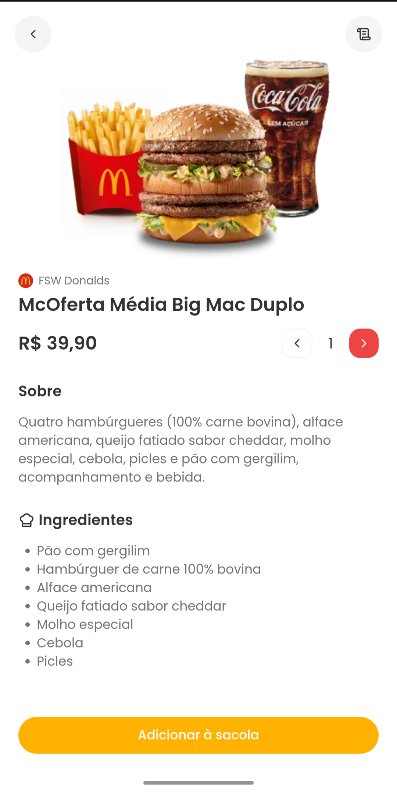
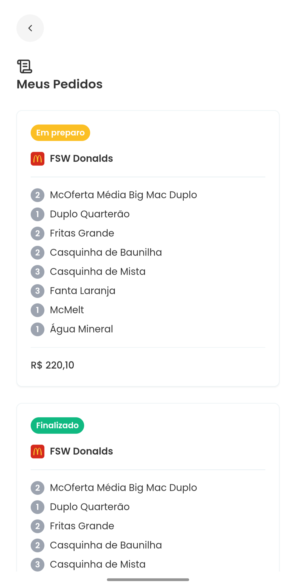

<!--

  
  
  
  

-->

# FSW Donalds 🍔

Este projeto foi desenvolvido durante a Full Stack Week com o objetivo de criar uma aplicação web para um sistema de delivery de alimentos, inspirado em plataformas populares como iFood.

## Tecnologias Utilizadas 🛠️

- **Next.js**: Framework React para construção de aplicações web.
- **Prisma**: ORM para interagir com o banco de dados de forma eficiente.
- **PostgreSQL**: Banco de dados relacional utilizado para armazenar as informações.
- **Tailwind CSS**: Framework CSS para estilização da aplicação.

## Funcionalidades 🚀

- **Visualização de Restaurantes**: Explore uma variedade de restaurantes disponíveis na plataforma.
- **Carrinho de Compras**: Adicione itens ao carrinho e gerencie suas seleções antes de finalizar o pedido.
- **Pedidos em Tempo Real**: Acompanhe o status dos seus pedidos em tempo real.

## Este projeto foi desenvolvido durante a Full Stack Week, orientado por Felipe Rocha. Você pode encontrar mais informações sobre o evento no canal do YouTube
